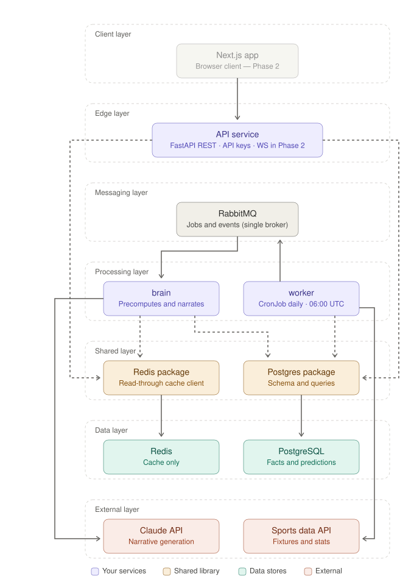

# A-Game

A football predictions service: it ingests match results, rates teams with Elo, converts those
ratings into scoreline probabilities with a Poisson model, and has a language model write the
preview text that explains what the numbers say. Six workloads on Kubernetes, a default-deny
network, every container non-root, all model traffic through a gateway that owns the credentials
and the cost controls.

## What it's for

Predictions have a commercial shape: bookmakers publish odds, a model publishes probabilities, and
the gap between the two is where value sits. The system is built around the properties that make
that gap trustworthy rather than just computable.

**Probabilities, not tips.** Elo ratings feed a Poisson scoreline model, so every output is a
distribution with arithmetic behind it and no opinion in it.

**Auditable after the fact.** Predictions are persisted permanently and tagged with the model
version that produced them, so accuracy is measured rather than claimed. Most prediction products
cannot tell you how they did last season.

**No invented statistics.** The maths is deterministic and lives in code. The language model only
phrases the output — it never sources a number. In a domain adjacent to real money, a narration
layer that can hallucinate a stat is a liability, not a feature.

**Cost scales with new information, not with elapsed time.** Ingestion is change-gated: a run that
finds nothing new publishes nothing, and the expensive half of the pipeline stays asleep. Fixtures
arrive in weekend and midweek clusters, so most runs have nothing to say.

**Predictable read latency.** Nothing is computed on request. The API serves what was already
written, so there are no pending states, no polling, and no request that can take four seconds.

Value betting — comparing model probability against published odds — is the commercial endpoint.
It currently returns `null` because odds feeds are paywalled, but the schema and the read path are
already shaped for it.



More views — network topology, the AI platform layer, IRSA, the request flows — are in
[`docs/system-design/`](docs/system-design/).

## How it works

Three services, one pipeline:

**worker** (`a-game-worker`) — a CronJob that runs daily at 06:00 UTC. It fetches from
[football-data.org](https://www.football-data.org), upserts the facts into Postgres, and publishes a
"data ready" job *only if the upsert actually changed a row*. A run that changes nothing publishes
nothing and exits. That constraint is the whole design
([ADR 0007](docs/adr/0007-ingestion-cadence-daily-change-gated.md)) — firing the prediction pipeline
on byte-identical inputs is spending money to recompute yesterday.

**brain** (`a-game-brain`) — consumes that job, recomputes ratings and probabilities for upcoming
fixtures, has the model narrate them, writes results back to Postgres and warms Redis.

**api** (`a-game-api`) — four read-only `GET` endpoints serving what the brain already computed.
Contract in [`docs/api-spec.md`](docs/api-spec.md).

Alongside them: Postgres, Redis, RabbitMQ, and a LiteLLM gateway that every model call goes through.

## Platform

### Network

The namespace is closed in both directions by two empty NetworkPolicies, then opened path by path.
NetworkPolicy is default-*allow* — a pod is wide open until some policy selects it, the opposite of
a security group — so the empty policies are what drag every pod, including new ones, into the
firewalled set.

DNS gets an explicit hole to CoreDNS in `kube-system`, because name resolution is ordinary
pod-to-pod traffic and is blocked like anything else. Miss it and every hostname fails in a way that
looks exactly like the database being down.

Every other rule names both ends: the client's egress *and* the server's ingress. Selectors are pod
labels, never Service IPs, because kube-proxy rewrites the Service IP to a pod IP before policy is
evaluated — and policy is evaluated against the endpoint, so a rule written against a Service port
silently matches nothing. The two `ipBlock` rules are the ones with no pod to select: the worker
reaching football-data.org, and the gateway reaching the model providers. The second is
`0.0.0.0/0:443` rather than named ranges, because the providers sit behind CDNs that rotate
addresses — so the enforced boundary there is *which pod may egress*, not where it may go.

Rules are verified by connection, not by a clean `kubectl apply`. A valid policy with the wrong port
number applies without complaint and fails at runtime with no log line anywhere.

Full annotated policy set in [`k8s/50-networkpolicies.yaml`](k8s/50-networkpolicies.yaml).

### Container security

Every workload runs as a non-root user with `allowPrivilegeEscalation: false` and all Linux
capabilities dropped. The uids come from the images, not from guesswork — 1000 for the three
services built here, 70 for `postgres:16-alpine`, 999 for redis, rabbitmq and litellm.

The three images under our control also set `readOnlyRootFilesystem: true`, with an `emptyDir`
mounted at `/tmp` for what Python still needs to write. The four third-party images don't, because
their write paths can't be audited.

Service accounts set `automountServiceAccountToken: false`. Nothing here talks to the Kubernetes
API, so nothing gets a token worth stealing.

Secrets are created imperatively and never committed. Kubernetes Secrets are base64, not encryption
— on EKS these move to SSM Parameter Store fronted by External Secrets, with an IRSA role scoped to
a single parameter path.

### AI platform

Model calls don't go straight to the provider. They go through a LiteLLM gateway
([ADR 0008](docs/adr/0008-ai-platform-layer.md)) that owns the API keys, so credentials exist in
Secrets mounted into exactly one pod and the application services hold none. It also gives one
place to set retries, timeouts, per-model routing and spend limits without redeploying anything
downstream — model access treated as infrastructure with a bill attached, rather than as a library
import.

Two providers sit behind it: Claude Haiku as the primary route, OpenAI as its configured fallback.
A single model behind a gateway is just a proxy — the routing and failover are the part worth
building, and a fallback nobody has watched fire is indistinguishable from one that doesn't work.
The application asks for a model alias and never learns which provider answered.

That does mean one pod now holds two providers' keys. The blast radius is still a single pod, and
a gateway per provider would double the workload count to narrow it no further.

Tracing (Langfuse) and eval gating in CI are the next pieces and aren't built yet. The eval
harness is the flagship of the whole layer, not a checkbox: a golden fixture set committed to
the repo, a fact-checker that turns "the AI never invents stats" into a CI assertion, an
LLM-as-judge whose own prompt is versioned, and a regression gate — a prompt change goes
through a PR like a code change, and can fail the build like one. The same harness then drives
a model-comparison report (quality, latency, cost per preview, per route), so the choice of
primary and fallback is measured rather than configured. Planned behind those: a tool-using
match-analyst agent, a self-hosted ~3B model as a third gateway route at CPU scale, and an AI
threat-model doc (ADR 0008, 2026-08-05). Deliberate non-goals: fine-tuning, chatbots,
semantic caching.

### Infrastructure

Terraform in three layers — network, cluster, app — with separate state per layer, so a mistake in
one can't take down another.

The network layer runs against LocalStack and applies cleanly. The cluster layer is deliberately
plan-only: LocalStack Community doesn't emulate EKS, and pretending otherwise would be theatre
([ADR 0009](docs/adr/0009-local-validation-eks-plan-only-k3s-for-kubernetes.md)). That split
separates two questions that fail in different ways — is the Terraform correct, and are the
manifests correct — and tests each where it can actually be answered. Manifests are enforced on a
real k3s cluster via k3d.

## How it was built

Decisions are argued out in [`docs/adr/`](docs/adr/) before they're implemented, and the reasoning
is kept even when the conclusion is later reversed — ADR 0004 overturns an earlier language choice
and both are still in the tree, because the argument that turned out to be wrong is the part worth
reading.

Manifests are hand-written and applied in numeric order. No Helm: every security control is visible
in the file that declares the workload rather than inherited from a chart's defaults, which is what
makes the network and container posture above reviewable at all.

Constraints are chosen before code. The change-gate, the precomputed read path and the
credential-isolating gateway are all decisions recorded with their trade-offs, not optimisations
discovered later.

Behaviour is verified rather than assumed — network paths proven by connection from a labelled pod,
container users confirmed against the running process, Terraform validated by plan. Several entries
in the section below are the direct result of that discipline finding something a green deploy had
hidden.

## Decisions worth reading

- **[ADR 0009](docs/adr/0009-local-validation-eks-plan-only-k3s-for-kubernetes.md) — validate
  locally, keep EKS plan-only.** Splits Terraform correctness from Kubernetes correctness and solves
  each where it's testable.
- **[ADR 0007](docs/adr/0007-ingestion-cadence-daily-change-gated.md) — daily, change-gated
  ingestion.** The pipeline fires on changed rows, not on a schedule, so operating cost tracks new
  information.
- **[ADR 0005](docs/adr/0005-v1-service-architecture.md) — three services, one broker.** The API
  never computes. Everything it serves was precomputed by the brain, which is what makes read
  latency predictable.
- **[ADR 0004](docs/adr/0004-language-switch-python.md) — switch to Python.** Reverses an earlier
  decision. The prediction engine is numerical work and the ecosystem argument won.
- **[ADR 0008](docs/adr/0008-ai-platform-layer.md) — an AI platform layer, not an SDK call.**
  Gateway, tracing, and — as the flagship — evals in CI; plus an agent, a self-hosted route,
  and a threat model (2026-08-05 amendment).

## Things that broke, and why

- **EKS silently ignores NetworkPolicy.** Without the VPC CNI policy agent or Calico, every policy
  in this repo is accepted by the API server and enforced by nothing. The worst failure mode there
  is: no error, no event, just an isolation guarantee that doesn't exist.
- **Postgres wouldn't start with capabilities dropped.** Its entrypoint starts as root, chowns the
  data directory, then drops to the postgres user with `su-exec`. `drop: ALL` kills both steps. The
  fix wasn't handing capabilities back — it was running as uid 70 from the start, so the entrypoint
  skips its root branch entirely and needs none.
- **A NetworkPolicy with the wrong port applies cleanly and fails silently.** Schema validation
  catches a misspelled field. It cannot catch a port number that's valid and wrong, and the
  resulting refusal is indistinguishable from a dead server.
- **`readOnlyRootFilesystem` and `emptyDir` at `/tmp` are a pair.** Setting one without the other
  produces a crash loop at import time, well before any application code runs.
- **The LiteLLM config is a volume, not `envFrom`.** `config.yaml` isn't a legal environment
  variable name, so `envFrom: configMapRef` skips it and logs an `InvalidVariableNames` event most
  people never look at. Volume-mounted ConfigMaps also update live; env vars are frozen at pod start.

## Cost

Currently zero — k3d and LocalStack run on a laptop.

The EKS numbers that matter: the control plane is $0.10/hour whether the cluster is empty or busy,
about $73/month. NAT Gateways are the line item that hurts — roughly $32/month each plus data
processing, and private-subnet pods need one per AZ to reach football-data.org and the model
provider.

So the plan is short, deliberate runs with a full teardown afterwards. Teardown has its own trap:
`type: LoadBalancer` Services and PVC-backed EBS volumes are created by Kubernetes rather than
Terraform, so `terraform destroy` leaves them behind, billing quietly.

## Stack

Python 3.12 with FastAPI and pydantic, managed by `uv`. PostgreSQL is the only system of record —
raw payloads land in JSONB alongside typed columns, and predictions are kept permanently and tagged
with the model version. RabbitMQ carries jobs between services. Redis is a read-through cache and
nothing else; you could delete it and the design would still hold.

Everything is containerized: multi-stage builds, non-root, no package manager in the final image.
Kubernetes manifests are hand-written and applied in numeric order. Terraform is layered with
isolated state. Model access goes through LiteLLM.

The full breakdown, including what's decided and what isn't, is in
[`TECHSTACK.md`](TECHSTACK.md).

## Status

The platform is ahead of the application.

Working — the cluster, the network policies, the hardened workloads, the LiteLLM gateway, the
Terraform network layer, the schema, and a worker that fetches competitions and seasons into
Postgres on a schedule.

Not done:

- Match ingestion — the change gate and the fixture upsert
- The Elo/Poisson engine is written but not wired to anything
- Model narration is written but not wired either
- The predictions half of the schema isn't modelled yet
- CI exists for the three services but is unproven; the Terraform plan job from
  [ADR 0006](docs/adr/0006-cicd-github-actions-gitops-later.md) isn't built
- No metrics, logs or alerting
- Nothing has run on real AWS yet
- No auth on the API
- No odds feed, so value bets are `null`

Single replica per workload, one node, no HA — a deployment topology choice at this stage, not an
architectural constraint.

## Running it locally

You'll need Docker, [k3d](https://k3d.io), `kubectl`, and [uv](https://docs.astral.sh/uv/).

```bash
# supporting services (LocalStack, Postgres)
docker compose up -d

# cluster
k3d cluster create a-game
kubectl apply -f k8s/
```

Secrets are created imperatively and never committed:

```bash
kubectl create secret generic sports-api-credentials -n a-game \
  --from-literal=SPORTS_API_KEY='<your football-data.org key>'

kubectl create secret generic anthropic-credentials -n a-game \
  --from-literal=ANTHROPIC_API_KEY='<your Anthropic key>'
```

Apply the schema, in order — the files are numbered for foreign-key dependencies:

```bash
cd a-game-worker/postgres
for f in *.sql; do
  kubectl exec -i -n a-game a-game-postgres-0 -- \
    psql -U postgres -d a_game_db -v ON_ERROR_STOP=1 < "$f" || break
done
```

The worker won't fetch anything until you pick a league — competitions arrive disabled by default:

```sql
UPDATE a_game.competition SET enabled = true WHERE code = 'PL';
```

To run ingestion now rather than waiting for 06:00:

```bash
kubectl create job --from=cronjob/a-game-worker worker-manual-1 -n a-game
kubectl logs -n a-game job/worker-manual-1 -f
```

## Layout

```
a-game-api/         FastAPI read API
a-game-brain/       prediction engine + model narration
a-game-worker/      the worker CronJob, plus the schema DDL in postgres/
k8s/                manifests, applied in numeric order
infrastructure/     Terraform, layered: network → cluster → app
.github/workflows/  CI per service, plus manifest validation
docs/adr/           why things are the way they are
docs/system-design/ diagrams
localstack/         local AWS init scripts
```

## Docs

- [`TECHSTACK.md`](TECHSTACK.md) — stack, decisions, open questions
- [`docs/schema.md`](docs/schema.md) — database schema and the change-detection strategy
- [`docs/api-spec.md`](docs/api-spec.md) — API contract
- [`docs/input-spec.md`](docs/input-spec.md) — what the prediction engine consumes
- [`docs/system-design/`](docs/system-design/) — architecture and flow diagrams
- [`docs/adr/`](docs/adr/) — architecture decisions, including the ones later overturned

## License

None yet. Ask if you want to use something.
